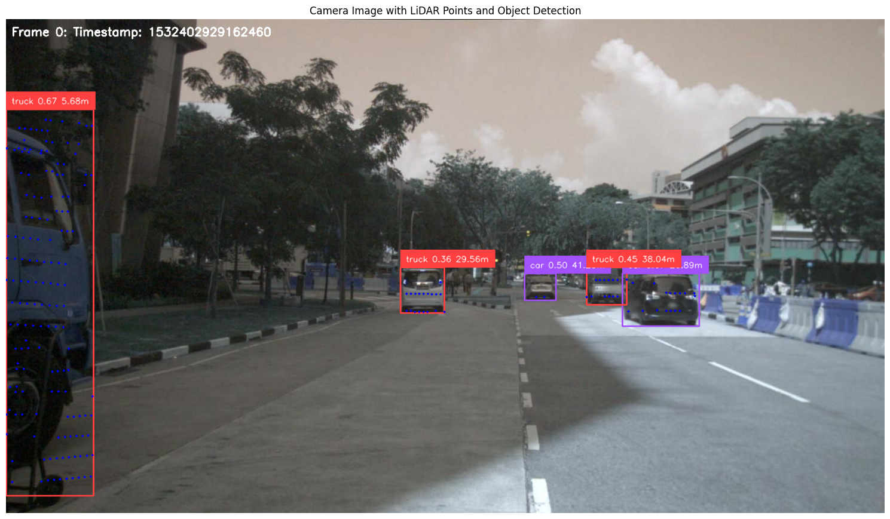
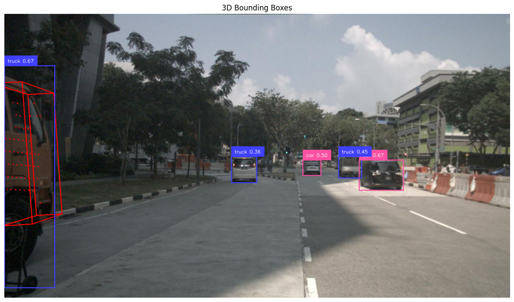

# Задание по 3D компьютерному зрению

Команда 2
- Астапенко Артем
- Иванов Матвей
- Миллер Алина

В данном репозитории представлена реализация базовой системы помощи водителю с использованием датасета NuScenes Mini. Система обнаруживает объекты на изображениях с камер, проецирует облака точек LiDAR на эти изображения и рассчитывает расстояния от автомобиля до обнаруженных объектов.

Пример работы в файле [combined_cameras.gif](https://drive.google.com/file/d/1gfdBgQmIq5w_leb4NA2_fOKuio3yAFOe/view?usp=sharing)

## Начало работы

Проект предпологает, что датасет NuScenes Mini расположен в папке `./v1.0-mini`. Если вы хотите использовать другой путь, то можно изменить переменную `nuscenes_root_dir` в начале файла [report.py](./report.py)

Установить зависимости можно с помощью команды:

Для работы необходимо иметь версию Python <=3.10.

```bash
uv sync
```

для запуска скрипта используйте команду:

```bash
python report.py
```

## Обзор проекта

Целью данного проекта была разработка простой системы помощи водителю со следующими функциями:
- 2D детекция объектов на изображениях с камер
- Проекция облака точек LiDAR на изображения с камер
- Оценка расстояния от автомобиля до обнаруженных объектов
- Визуализация результатов в демо-видео
- Поддержка всех шести камер в датасете NuScenes
- (Опционально) Оценка 3D ограничивающих рамок

## Детали реализации

### 1. 2D детекция объектов

Для обнаружения объектов на изображениях с камер была использована модель YOLO-World. Модель настроена на обнаружение следующих классов объектов:
- автомобили
- грузовики
- автобусы
- мотоциклы
- велосипеды
- люди
- светофоры
- знаки остановки
- пожарные гидранты
- конусы

### 2. Проекция облака точек LiDAR

Для проекции точек LiDAR на изображения с камер был реализован алгоритм, который:
1. Преобразует координаты точек LiDAR из системы координат датчика в систему координат автомобиля (ego vehicle)
2. Преобразует координаты из системы координат автомобиля в систему координат камеры
3. Проецирует 3D точки на 2D плоскость изображения с использованием матрицы внутренних параметров камеры
4. Фильтрует точки, находящиеся вне поля зрения камеры

### 3. Оценка расстояния до объектов

Для каждого обнаруженного объекта:
1. Определяются точки LiDAR, попадающие внутрь ограничивающей рамки объекта
2. Рассчитывается медианное расстояние до этих точек, что дает оценку расстояния от автомобиля до объекта
3. Расстояние отображается рядом с меткой объекта на изображении

### 4. Визуализация результатов

Результаты обработки каждого кадра включают:
- Изображение с камеры с наложенными ограничивающими рамками объектов
- Метки объектов с указанием класса, уверенности детекции и расстояния
- Проецированные точки LiDAR, выделенные синим цветом
- Временная метка кадра



### 5. Поддержка всех камер

Система обрабатывает данные со всех шести камер NuScenes:
- CAM_FRONT
- CAM_FRONT_LEFT
- CAM_FRONT_RIGHT
- CAM_BACK
- CAM_BACK_LEFT
- CAM_BACK_RIGHT

Для каждой камеры создается отдельное GIF-видео, а также формируется комбинированное видео со всеми камерами в сетке 2×3.


### 6. Оценка 3D ограничивающих рамок

Для оценки 3D ограничивающих рамок объектов был реализован следующий алгоритм:

1. **Сегментация объектов**: Для каждого обнаруженного объекта используется модель SAM (Segment Anything Model) для получения точной маски объекта на изображении.
2. **Фильтрация точек LiDAR**: Из всех проецированных на изображение точек LiDAR выбираются только те, которые попадают внутрь маски объекта.
3. **Кластеризация точек**: Применяется алгоритм DBSCAN для кластеризации 3D точек, принадлежащих объекту, что позволяет отделить точки объекта от фоновых точек и шума.
4. **Анализ главных компонент (PCA)**: Для каждого кластера точек выполняется PCA для определения основных осей объекта в 3D пространстве.
5. **Построение 3D ограничивающей рамки**: На основе главных компонент и проекций точек на эти компоненты вычисляются 8 вершин 3D ограничивающей рамки, ориентированной вдоль основных осей объекта.
6. **Проекция 3D рамки на изображение**: Вершины 3D рамки проецируются обратно на 2D изображение с использованием матрицы внутренних параметров камеры.
7. **Визуализация**: Рёбра 3D ограничивающей рамки отображаются на изображении разными цветами в зависимости от класса объекта (зеленым для автомобилей, красным для других объектов).

Этот подход позволяет получить более точное представление о форме и ориентации объектов в 3D пространстве по сравнению с простыми 2D ограничивающими рамками.

Пример:

